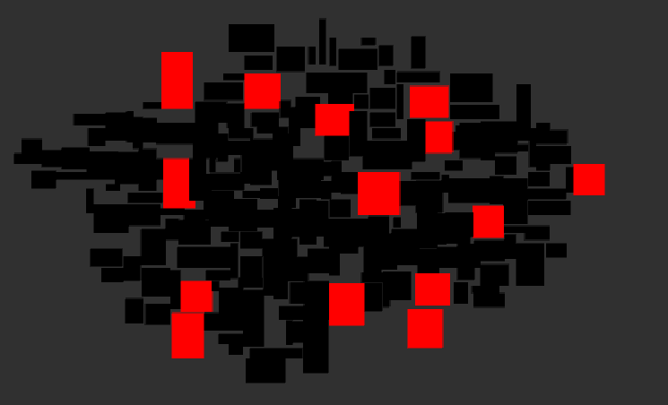
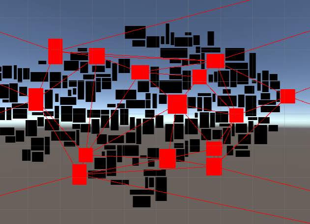
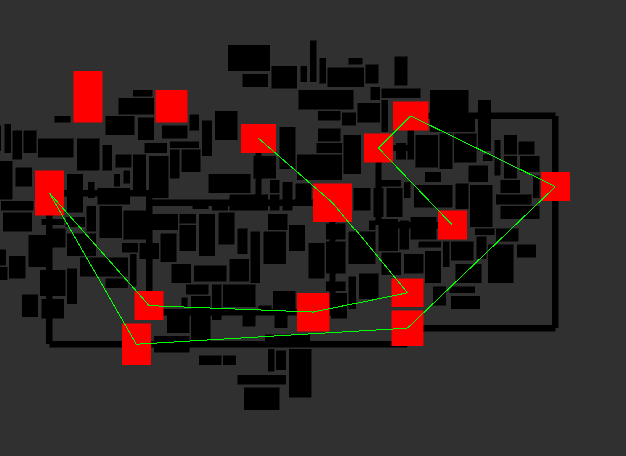
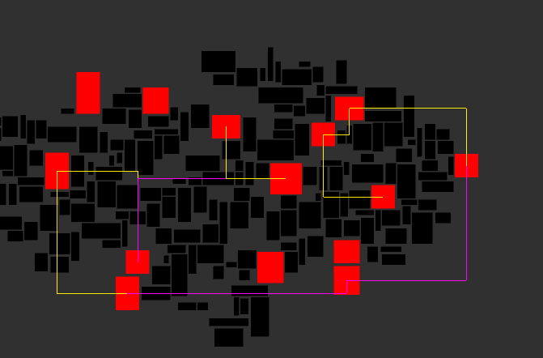
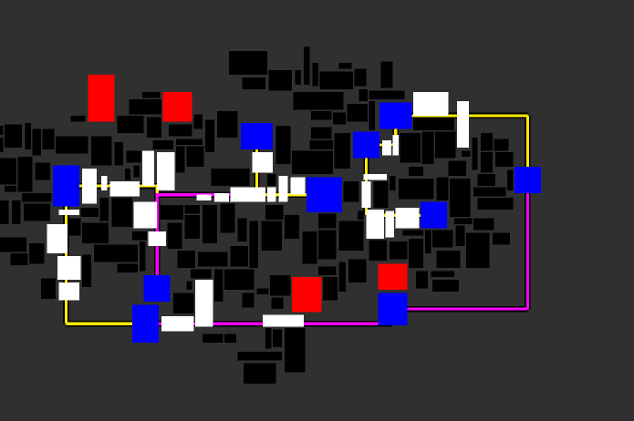

# Procedural_Dungeon_Rooms
## Procedural rooms algorithm using delaunay

1. Generate squares of random sizes and let unity seperate them (with some optimizations from my side like maintain grid)

2. Highlight and store rooms which can be *Main Rooms*

3. Delaunay triangulate paths between these rooms

4. Choose one minimal spanning path

5. draw lines beteween these paths (usually L shaped and non overlapping for proper dungeon)

6. finally highliged rooms and path for one particular dungeon path

## Usage
- Change number of redRooms (in Rooms.cs) to get more rooms
- can be used in procedural room based roguelike rpg

## Improvements
- Step 5 can have better lines drawn for covering more in between rooms
  - wider raycast
  - other shapes that wont overlap
- The sqaures in step 1 always end up with some space between them due to optimization
  - a way to bring them closer after the final seperation
